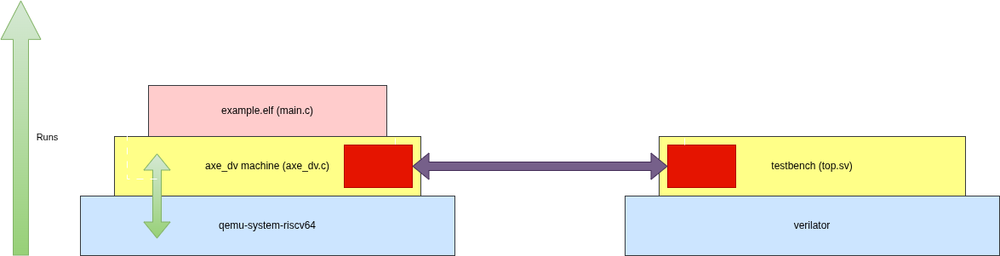

# qemu ↔️ multisim setup

Test setup enabling RISCV test code running on `qemu-system-riscv64` to communicate with an rtl sim via DPI and [multisim](https://github.com/antoinemadec/multisim/tree/main).

## Description

Here is how the setup works:



A custom device, 'axe-dv-rtl-sim', is instantiated inside a machine (i.e. the emulated version of a chip) at address `0x100000000`. Its write and read methods have been overridden to connect through with the rtl sim running in parallel. Every time the program running on this machine performs accesses to the address range of 'axe-dv-rtl-sim', the latter forwards the access details to the testbench and then wait for a response. That response is passed back to the machine and the execution continues.

## How to run

- Checkout all submodules:
```bash
git submodule init
git pull --recurse-submodules
```

### Local run (non-hetzner)

- Make sure `verilator`, `riscv64-elf-gcc` and `riscv64-elf-objdump` are installed.
- Do `run.sh` to compile and run everything.

- Execute `run.sh` to compile and run everything
