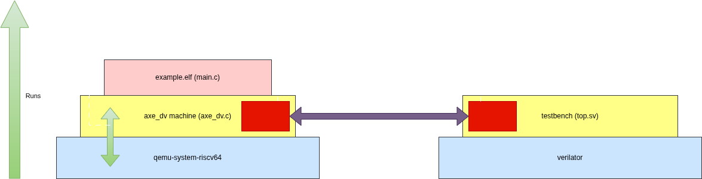

# qemu ↔️ multisim setup

Test setup enabling RISCV test code running on `qemu-system-riscv64` to communicate with an rtl sim via DPI and [multisim](https://github.com/antoinemadec/multisim/tree/main).

## Description

Here is how the setup works:



A custom device, `axe-dv-rtl-sim`, is instantiated inside a machine (i.e. the emulated version of a chip) at address `0x100000000`. Its write and read methods have been overridden to connect to a rtl sim running in parallel. Every time the program performs accesses to the address range of `axe-dv-rtl-sim`, the latter forwards the access info to the testbench and waits for a response. That response is then passed back to the machine and the execution continues. Interrupts are handled by forwarding any state change to QEMU through a separate multisim channel. A dedicated thread takes care of triggering IRQs upon receiving packets.

Links to the different pieces:

- Custom device to communicate with QEMU: [axe-dv-rtl-sim.c](https://github.com/jrmsgr/qemu/blob/jrmsgr/axe-dv-rtl-sim/hw/misc/axe-dv-rtl-sim.c)
- Custom QEMU platform containing `axe-dv-rtl-sim`: [axe_dv.c](https://github.com/jrmsgr/qemu/blob/jrmsgr/axe-dv-rtl-sim/hw/riscv/axe_dv.c)
- RTL testbench: [top.sv](./tb/top.sv)
- QEMU packets to AXI adapter: [axe-dv-axi-adapter.sv](./tb/axe-dv-axi-adapter.sv)
- Interrupt forward block: [axe-dv-interrupt-adapter.sv](./tb/axe-dv-interrupt-adapter.sv)
- SW test running on QEMU: [main.c](./sw/src/main.c)

## How to run

- Checkout all submodules:
```bash
git submodule init
git submodule update
```
- Make sure `verilator`, `gcc/g++ >= 16.1.1`, `riscv64-elf-gcc` and `riscv64-elf-objdump` are installed.
- Execute `run.sh` to compile and run everything

## Building QEMU

Since the QEMU version used by this example has been customized to add multisim support, it must be built from source. The sections below detail how to proceed for Rocky 8 Linux and Arch Linux.

### On Rocky8

```bash
cd qemu-multisim-setup
git submodule init
git submodule update

# Install required packages and enable gcc-toolset
sudo dnf install git make python39 gcc-toolset-15 wget flex bison bzip2
scl enable gcc-toolset-15 bash
sudo python3.9 -m pip install --upgrade "setuptools>=64"
pip3.9 install --user wheel tomli ninja meson
./scripts/rocky8.sh
```

### AppImage build

`qemu` and its dependencies can be bundled inside an AppImage using `scripts/build_appimage.sh`.

A `docker-compose.yml` is also provided to automatically build it inside a `rocky8` docker image. Make sure `docker` is installed on your machine, then run:

```bash
cd qemu-multisim-setup
git submodule init
git submodule update
docker compose run --build --rm build-appimage
```

The resulting artifact, `./QemuMultisim-x86_64.AppImage`, can be executed as is:

```
❯ ./QemuMultisim-x86_64.AppImage -machine help
Supported machines are:
amd-microblaze-v-generic AMD Microblaze-V generic platform
axe_dv               RISC-V AxeDv board
boston-aia           MIPS Boston-aia
microchip-icicle-kit Microchip PolarFire SoC Icicle Kit
none                 empty machine
shakti_c             RISC-V Board compatible with Shakti SDK (deprecated)
sifive_e             RISC-V Board compatible with SiFive E SDK
sifive_u             RISC-V Board compatible with SiFive U SDK
spike                RISC-V Spike board
virt                 RISC-V VirtIO board
xiangshan-kunminghu  RISC-V Board compatible with the Xiangshan Kunminghu FPGA prototype platform
```

Or with `APPIMAGE_EXTRACT_AND_RUN=1` if [FUSE](https://github.com/AppImage/AppImageKit/wiki/FUSE) is not installed:

```bash
APPIMAGE_EXTRACT_AND_RUN=1 ./QemuMultisim-x86_64.AppImage -machine help
```
